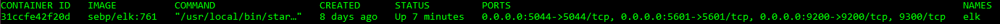

## Automated ELK Stack Deployment

The files in this repository were used to configure the network depicted below.

These files have been tested and used to generate a live ELK deployment on Azure. They can be used to either recreate the entire deployment pictured above. Alternatively, select portions of the YML file may be used to install only certain pieces of it, such as Filebeat.

  - Install Elk 
  - Install Filebeat 
  - Install Metricbeat 

This document contains the following details:
- Description of the Topology
- Access Policies
- ELK Configuration
  - Beats in Use
  - Machines Being Monitored
- How to Use the Ansible Build

### Description of the Topology

The main purpose of this network is to expose a load-balanced and monitored instance of DVWA, the D*mn Vulnerable Web Application.

Load balancing ensures that the application will be highly stable, in addition to restricting connections to the network.
- Load balancers, as their name implies, balance the load between web servers. Having a load balancer helps ensure availability. If a one web server goes down, the other two pick up the slack. Having a jump box allows easier in and out for administrators and makes setting rules much easier. 

Integrating an ELK server allows users to easily monitor the vulnerable VMs for changes to the logs and system Traffic.
- Filebeat monitors log files and logs events.
- Metricbeat helps monitor servers by collecting metrics from the system and services running on the server.

The configuration details of each machine may be found below.

| Name                 | Function   | IP Adress | Operating System |
|----------------------|------------|-----------|------------------|
| Jump-box-Provisioner | Gateway    | 10.0.0.8  | Linux            |
| Web-1                | Server     | 10.0.0.11 | Linux            |
| Web-2                | Server     | 10.0.0.10 | Linux            |
| Web-3                | Server     | 10.0.0.13 | Linux            |
| Elk-Machine          | Log Server | 10.1.0.4  | Linux            |
### Access Policies

The machines on the internal network are not exposed to the public Internet. 

Only the Jump-Box-Provisioner machine can accept connections from the Internet. Access to this machine is only allowed from the following IP addresses:
- My Personal IP

Machines within the network can only be accessed by Jump-box-Provisoner's docker container.
- The Elk-Machine can only be accessed by ssh through the Jump-box-Provisioner. The Elk-Machine can only be connected by web by My Personal IP.

A summary of the access policies in place can be found in the table below.

| Name                 | Publicly Accessible | Allowed IP Addresses |
|----------------------|---------------------|----------------------|
| Jump-Box-Provisioner | Yes                 | My Personal          |
| Load Balancer        | Yes                 | My Personal          |
| Web-1                | No                  | 10.0.0.8             |
| Web-2                | No                  | 10.0.0.8             |
| Web-3                | No                  | 10.0.0.8             |
| Elk-Machine          | Yes                 | My Personal          |

### Elk Configuration

Ansible was used to automate configuration of the ELK machine. No configuration was performed manually, which is advantageous because configurations can be easily set up on new machines or if configurations need updating it is much faster than doing each one individually. If you set up right the first time, you set it up right every time. Doing those type of tasks manually could easily lead to mistakes on the human end of things and each server could have it's own configuration by accident.

The playbook implements the following tasks:
- ... Installs docker.io, pip3 and docker pip module
- ... Increases the virtual memory
- ... Installs the Elk image
- ... Sets Ports

The following screenshot displays the result of running `docker ps` after successfully configuring the ELK instance.

### Target Machines & Beats
This ELK server is configured to monitor the following machines:

- Web-1 10.0.0.11
- Web-2 10.0.0.10
- Web-3 10.0.0.13
- Elk Machine 10.1.0.4
We have installed the following Beats on these machines:
- Filebeat and Metricbeat

These Beats allow us to collect the following information from each machine:
- Filebeat collects log file where you specify, such as a log file of someone trying to log in but failing.
- Metricbeat collects metrics and statistics from the opperating system. An example being cpu or ram usage to see when the machine is getting stressed.

### Using the Playbook
In order to use the playbook, you will need to have an Ansible control node already configured. Assuming you have such a control node provisioned: 

SSH into the control node and follow the steps below:
- Copy the filebeat-config.yml or the metricbeat-config.yml file to /etc/ansible/files.
- Update the config file to include the elk server's private ip
- Run the playbook, and navigate to http://<ELK.VM.External.IP>:5601/app/kibana to check that the installation worked as expected.

- _Which file is the playbook? Where do you copy it?
- filebeat-playbook.yml  
- metricbeat-playbook.yml
- install-elk.yml
- Copy it to /etc/ansible/
- 
- _Which file do you update to make Ansible run the playbook on a specific machine? How do I specify which machine to install the ELK server on versus which to install Filebeat on?_
- 
- Edit the Hosts file in /etc/ansbile to look something like this.
	`
	[webservers]
	 10.0.0.8 ansible_python_interpreter=/usr/bin/python3
	[elk]
	 10.1.0.4 ansible_python_interpreter=/usr/bin/python3
	`
- 
- _Which URL do you navigate to in order to check that the ELK server is running?_
- http://<ELK.VM.External.IP>:5601/app/kibana

_As a **Bonus**, provide the specific commands the user will need to run to download the playbook, update the files, etc._

- To run the Install Elk playbook the command is `ansinble-playbook /etc/ansbile/install-elk`
- To run the filebeat playbook the command is `ansible-playbook /etc/ansbile/filebeat-ansible`
- to run the metricbeat playbook the command is `ansible-playbook /etc/ansbile/metricbeat-ansible`
- To update filebeat or metricbeat change the link and the version in the dpkg command in the playbook to a more updated one
